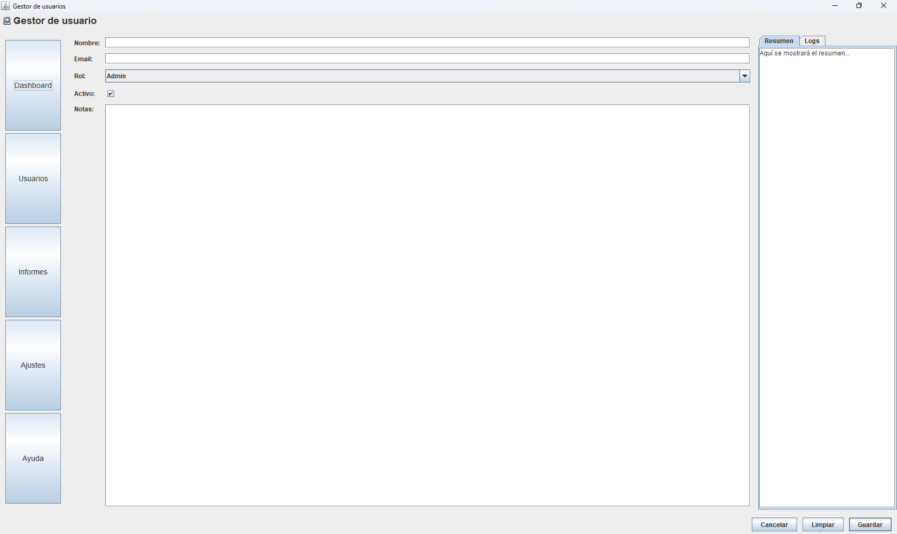
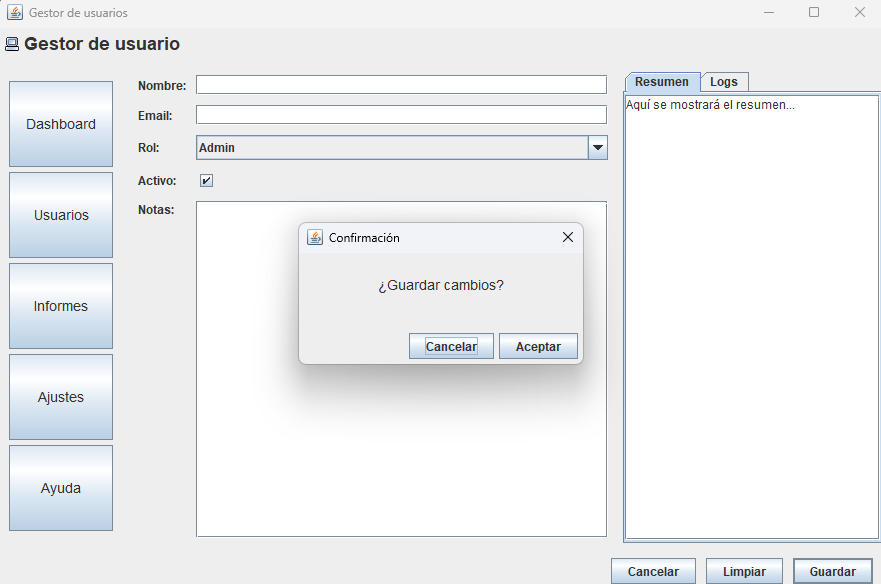

# 📋 Gestor de Usuarios - Práctica Tema 2

> **Paneles y Layouts como profesionales**  
> Ejercicio de diseño de interfaces con Java Swing utilizando múltiples layouts y componentes avanzados.

---

## 📝 Descripción del Proyecto

Este proyecto implementa una interfaz gráfica completa de un **Gestor de Usuarios** utilizando Java Swing. El objetivo principal es demostrar el uso profesional de diferentes layouts (`BorderLayout`, `FlowLayout`, `GridLayout`, `GridBagLayout`) en una aplicación real, junto con un diálogo modal de confirmación.

### ✨ Características Principales

- ✅ Interfaz multipanel con diseño jerárquico
- ✅ Formulario completo con validación visual
- ✅ Navegación lateral con 5 secciones
- ✅ Panel de previsualización con pestañas
- ✅ Diálogo modal de confirmación
- ✅ Diseño responsive y redimensionable

---

## 🏗️ Arquitectura de Contenedores

### Árbol de Componentes

```
JFrame (BorderLayout)
 ├─ NORTH: headerPanel (FlowLayout)
 │   └─ JLabel (título + icono)
 │
 ├─ WEST: navPanel (GridLayout 5x1)
 │   ├─ JButton "Dashboard"
 │   ├─ JButton "Usuarios"
 │   ├─ JButton "Informes"
 │   ├─ JButton "Ajustes"
 │   └─ JButton "Ayuda"
 │
 ├─ CENTER: formPanel (GridBagLayout)
 │   ├─ Fila 0: JLabel "Nombre" + JTextField
 │   ├─ Fila 1: JLabel "Email" + JTextField
 │   ├─ Fila 2: JLabel "Rol" + JComboBox
 │   ├─ Fila 3: JLabel "Activo" + JCheckBox
 │   └─ Fila 4: JLabel "Notas" + JTextArea (JScrollPane)
 │
 ├─ EAST: previewPanel (BorderLayout)
 │   └─ JTabbedPane
 │       ├─ Tab "Resumen" (JTextArea)
 │       └─ Tab "Logs" (JTextArea)
 │
 └─ SOUTH: buttonBar (FlowLayout RIGHT)
     ├─ JButton "Cancelar"
     ├─ JButton "Limpiar"
     └─ JButton "Guardar" (default button)
```

---

## 🎨 Layouts Utilizados

| Zona | Layout | Justificación |
|------|--------|---------------|
| **Root Frame** | `BorderLayout` | Permite organizar la ventana en 5 zonas claramente diferenciadas |
| **Header (NORTH)** | `FlowLayout` | Ideal para alinear título e icono en horizontal |
| **Navegación (WEST)** | `GridLayout 5x1` | Distribuye uniformemente los 5 botones en vertical |
| **Formulario (CENTER)** | `GridBagLayout` | Máxima flexibilidad para alinear etiquetas y campos con diferentes tamaños |
| **Previsualización (EAST)** | `BorderLayout` | Contiene el `JTabbedPane` que ocupa todo el espacio disponible |
| **Botonera (SOUTH)** | `FlowLayout RIGHT` | Alinea los botones de acción a la derecha |

---

## ⚙️ Propiedades Clave de GridBagLayout

### Configuración del Formulario Central

| Campo | gridx | gridy | weightx | weighty | fill | anchor | insets |
|-------|-------|-------|---------|---------|------|--------|--------|
| Label "Nombre" | 0 | 0 | 0 | 0 | NONE | WEST | 5,5,5,5 |
| TextField Nombre | 1 | 0 | 1.0 | 0 | HORIZONTAL | WEST | 5,5,5,5 |
| Label "Email" | 0 | 1 | 0 | 0 | NONE | WEST | 5,5,5,5 |
| TextField Email | 1 | 1 | 1.0 | 0 | HORIZONTAL | WEST | 5,5,5,5 |
| Label "Rol" | 0 | 2 | 0 | 0 | NONE | WEST | 5,5,5,5 |
| ComboBox Rol | 1 | 2 | 1.0 | 0 | HORIZONTAL | WEST | 5,5,5,5 |
| Label "Activo" | 0 | 3 | 0 | 0 | NONE | WEST | 5,5,5,5 |
| CheckBox Activo | 1 | 3 | 0 | 0 | NONE | WEST | 5,5,5,5 |
| Label "Notas" | 0 | 4 | 0 | 0 | NONE | NORTHWEST | 5,5,5,5 |
| TextArea Notas | 1 | 4 | 1.0 | 1.0 | BOTH | WEST | 5,5,5,5 |

### 🔑 Conceptos Clave

- **weightx = 1.0**: Los campos de texto se estiran horizontalmente al redimensionar
- **weighty = 1.0**: El área de notas crece verticalmente
- **fill = HORIZONTAL/BOTH**: Los componentes ocupan todo el espacio asignado
- **anchor = WEST**: Alineación a la izquierda
- **insets = 5,5,5,5**: Márgenes uniformes de 5px en todos los lados

---

## 📸 Capturas de Pantalla

### Vista General


### Ventana Redimensionada


### Panel de cONFIRMACIÓN - Pestañas



---

## 📂 Estructura del Proyecto

```
gestor-usuarios/
│
├── src/
│   ├── GestordeUsuarios.java      # Ventana principal
│   └── DialogConfirmacion.java    # Diálogo modal
│
├── screenshots/                   # Capturas de pantalla
│   ├── vista_general.png
│   ├── redimensionada.png
│   ├── pestanas.png
│   └── dialogo_modal.png
│
├── docs/
│   └── wireframe.pdf              # Boceto inicial
│
└── README.md
```

---

## 🔧 Funcionalidades Implementadas

### ✅ Componentes Swing
- [x] JFrame con BorderLayout
- [x] JPanel con diferentes layouts
- [x] JLabel con icono y texto
- [x] JButton con eventos
- [x] JTextField para entrada de texto
- [x] JComboBox con opciones predefinidas
- [x] JCheckBox para opciones booleanas
- [x] JTextArea con JScrollPane
- [x] JTabbedPane para pestañas
- [x] JDialog modal

### ✅ Comportamiento
- [x] Redimensionamiento responsive
- [x] Botón por defecto (Enter = Guardar)
- [x] Diálogo modal de confirmación
- [x] Tooltips informativos (opcional)

---

## 📚 Conceptos Aprendidos

1. **Planificación previa**: Importancia del wireframe y árbol de contenedores
2. **Layouts anidados**: Combinación de diferentes gestores de diseño
3. **GridBagLayout**: Control preciso mediante constraints
4. **Comportamiento modal**: Bloqueo de la ventana padre
5. **Responsive design**: Uso de weights y fill para redimensionamiento

---

## 🎯 Resultados de Aprendizaje

- **RA1**: Reconocer las características de lenguajes de programación orientados a objetos
- **RA4**: Desarrollar interfaces gráficas de usuario interactivas


